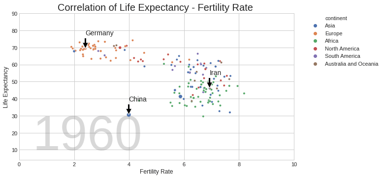

# Gapminder Animated Scatterplot
**This project is about data-visualisation:**
## 1. Reading 'csv' and 'excel' files into Pandas DataFrame
 - `pd.read_csv()`, `pd.read_excel()`
## 2. Data wrangling and cleaning
 - Accessing columns and index in DataFrame and their manipulation
    - `df.columns`, `df.index(.name)` , `df.reset_index()`
 - Formatting wide-long
    -  `df.melt()`
 - Merge tables
    - `df.merge(df2_to_be_merged_into_df1)`
## 3. Data Visualisation
 - Seaborn 
 - Matplotlib
    
 
 - Annotation
    - `plt.annotate()`
 - Creating .gif
    - imageio library `import imageio`
 
